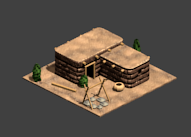
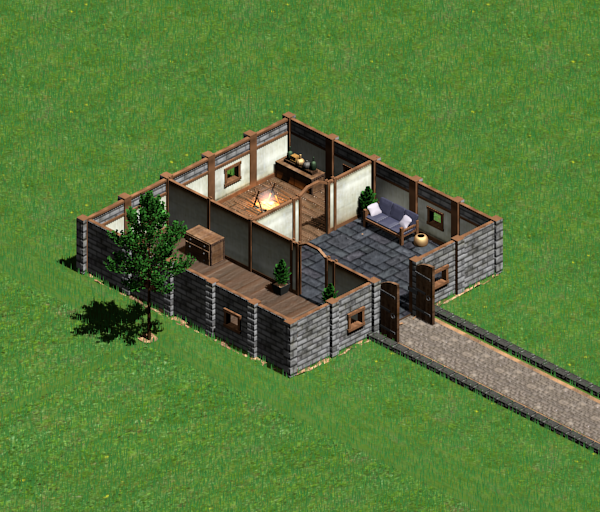
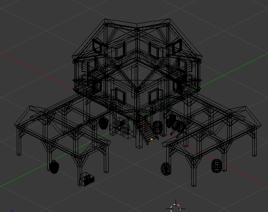
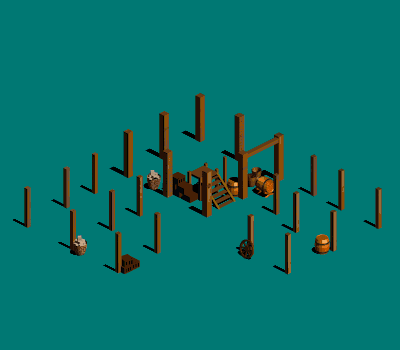
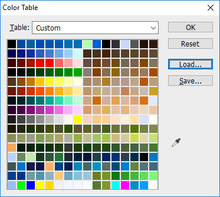

# Introduction

Hey everyone. Those who know me, might remember that I used to be a fervent fan of copy paste graphics. Since then however, I have made a 360° turn and have been spending quite some time time learning 3D modeling. To me 3D modeling has been more of a pastime than anything else, so I haven't been learning it as quickly as I would have wanted to, but nonetheless I think I have made some decent progress. Units and their animations are still a challenge for me, which is why I am going to talk in this thread only about buildings and eye candy, but I do hope to make threads about those as well in the future.

A while back, I started making Age of Empires 1 graphics. This is because the buildings are much smaller and have less detail than the Age of Empires 2 graphics, making it easier to model them. The textures and lighting are also simpler, which is good for someone who is new to modeling, and doesn't know advanced texturing or lighting techniques. I made a few models for Age of Empires 1 but to my own acknowledgement, they were quiet mediocre. Still at first I was the only 3D modeler/artist on aoe.heaven so people had no other choice than to praise my work (at least I had that going for me)\* Much changed when I got my hands on the original Age of Empires I models which were posted on aoe.heaven (thanks to CeaseDaFire, XLightningStormL and Phatfish) (Sorry if I missed someone). It still was not easy recreating the exact setting in blender since the original models were made in 3D max and all textures were missing. After much trial and error I got close to the originals though.

\*Other great graphics designers have also greatly contributed to the site since then, like Yohomes2 and Toddler.

One of my latest aoe I models

Of course I also worked on some other stuff which didn't really fit the Age of Empires II style but was still fun to do.

An indoor scene of a fantasy medieval building

This weekend I wanted to have another go at an Age of Empires II building, making it from scratch but armed with the knowledge I had acquired in the past months. In my opinion the best way to try to mimic a style is to recreate an existing building and so I started on the Castle Age Western European Town Center. I posted a wip in the "Your works of art" thread already but here is my latest version. The one thing I am still struggling with is figuring out how to do the roof tiles properly, so suggestions for that from other 3D artists are welcome. It's a start and I hope it is a solid foundation for future work.

An attempt at recreating the WE Castle Age Town Center

## Expectations
Since I have very little free time and am already committed to several projects, I will not be joining any new projects soon. So instead of me making graphics for you, I want to teach you guys how to make the graphics yourselves. In fact if there is enough interest I want to make tutorials and even maybe start a weekly challenge to practice a bit. Something simple like creating a wheelbarrow, or a small wooden bridge. It would be fun I think.

I know there are several other 3D artists here, but so far it seems like not much knowledge has been passed on. I will share my setup and knowledge of blender and I hope it will inspire others to do the same. It would be great if we can give feedback to each other and improve our 3D skills even further. You know, that would be pretty sick Bro.

## Why Blender?
There are many great 3D modeling programs out there, many arguably better than Blender. However Blender is free and since most of us are just hobby modders,
it is the most obvious one.

## The Stuff
Okay as promised, next up is the first tutorial. Post below what you think and share your ideas and interests. I will also be answering any modelling related questions you guys have.

Here's a little something for those who were willing to read through my long rant.

------------------------------------------------------------------------------------------------------------------------------------------------------

## Q&A

Q: How do you manage to reduce the loose in quality while converting to 8 bit format?

A: I try to stick to colors that can be found in the AoE palette. If you did this and the colors still mess up, then the issue might be with your program or its settings.

