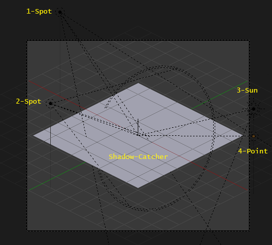

# Part I: Blender Setup and Rendering

*Disclaimer: Thanks to Jan dc on the AoK.heaven forums who lets us use this tutorial series. If you want to ask him questions about the guide or simply admre his work, visit [this](http://aok.heavengames.com/cgi-bin/forums/display.cgi?action=st&fn=9&tn=44487&st=recent&f=9,44487,0,10) thread.*

* **Content**: Basic Blender Aoe2 Setup Tutorial
* **Requirements**: Some knowledge of Blender and Photoshop
* **Estimated Time**: Short

## Expectations

So what can you expect from me and what do I expect from you. To be honest I have far too many times promised to help out other people with their projects, when I lacked the time or motivation to go through with it. This is why I am now saying in advance, that I am not inclined to help out other people's projects directly anymore. However instead I do want to help the people who are interested in learning 3D modeling. Something about teaching men to fish I guess. Either way I am willing to share my blender setup and material in the hopes that more people will learn this great skill. And maybe in the future we can share our work and techniques to further improve this already great modding community. It is not easy to learn 3D modeling but once you get the hang of it, it becomes very fun and rewarding to do.

How do you start? First download blender (use the site of blender itself to avoid malware) and look up some tutorials on the internet on how to do simple modeling. Start simple, by learning how to make objects and how to edit them. If there is enough interest in this tutorial maybe we can start a weekly challenge to learn blender together. For example simple exercises like making a barrel.

WARNING: Advanced content ahead. Only proceed if you know blender, or are willing to get confused.

## Lighting

Here I am using a variation of the three point lighting technique. A common mistake among beginner modelers (one which I also made) is to overload the scene with lights. To have a more realistic and better looking 3D scene, it is very important to show strong contrast between light and shadow. So keep the amount of lights to a minimum.
There is one deviation in this scene which is a fourth light, underneath the sun. As you may have noticed none of my lights cast shadows, except for the sun which only casts a shadow and no light. This is because the sun casts a very strong shadow, which is necessary for the ground shadow. The other front light is there to provide the front side of the building with light and soften the shadows cast by the sun on the building itself.

[1] Spot, behind the building. (Energy: 2.0) (Distance: 25.0) (Downwards angle: 52°) (No Shadow) (Specular and Diffuse)

[2] Spot, left of the building. (Energy: 1.0) (Distance: 10.0) (Downwards angle: 56°) (No Shadow) (Specular and Diffuse)

[3] Sun, in front of the building. (Energy: 2.0) (Downwards angle: 22°) (Only Shadows) (Specular and Diffuse)

[4] Point, in front of the building. (Energy: 7.0) (Distance: 25.0) (Downwards angle: 25°) (No Shadow) (Specular and Diffuse)

[5] (Indoor lighting, usually a yellow/orange area light)

## Camera

The camera in my setup is an orthographic one with value 11.5, it has a rotation of x:60° y:0° z:-135°\* and its coordinates are x:-12 y:12 z:10.

\*some say it is 59° along the x axis but doesn't matter much.

## Rendering

When rendering the graphic I am using 90% of a 1200 x 1024 resolution, Anti-Aliasing with a size of 1.3 pixels and a transparent background. Keep in mind that you need to get rid of the anti-aliasing pixels on the outside of the graphic as well. I have a technique for that, but it is not optimal. I will add it to this tutorial once it is has been improved.

## Layers

To get the best result, and to make it easier to convert the image to the right format, I use key frames and the timeline to hide certain materials. It is certainly not the best technique but it works well for buildings. In my setup I have four different layers.

* Ground shadows + Basic Material + Player Color
* Basic Material + Player Color
* Player Color
* Ground shadows

The advantage of this, is that I can process the different layers separately in Photoshop, and combine them once I am done. Since the Player Color is also separate I can use a Player Color only palette to make sure it uses the correct colors.

To use this technique you have to make use of the timeline (should be visible by default) and a transparency mask for all the materials. Set the current frame to 1 and key the Transparency Mask for all materials to 1. Then go to the second frame and set the Transparency Mask for all materials, except the Player Color ones to 0. Then set them all to 0 for the last frame. The ground plane, which has a material that only catches shadows, has its Transparency Mask set to 1 for frame zero and three, and set to 0 for frame one and two.

Town Center with all materials visible

Town Center with no Ground Shadows

Town Center with only Player Color

Town Center with only Ground Shadows

Conclusion
This is about all you need to know for this tutorial. If you have any more questions or want to express your interest in learning 3D modelling, post in the [original forum thread](http://aok.heavengames.com/cgi-bin/forums/display.cgi?action=ct&f=26,42291,,10) at AoK Heaven.

Thanks,
Jan

PS: For those data nerds among you, who say, "Don't we need to render the town center pieces separately?" The answer is no. If you look closely at the original town center graphics you can clearly see that the pieces are cut out in Photoshop, instead of rendered separately.
