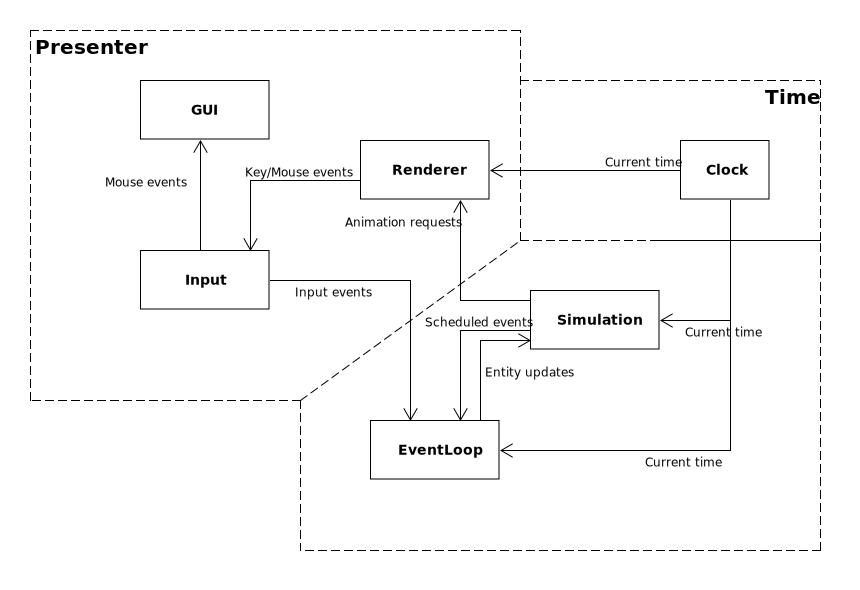
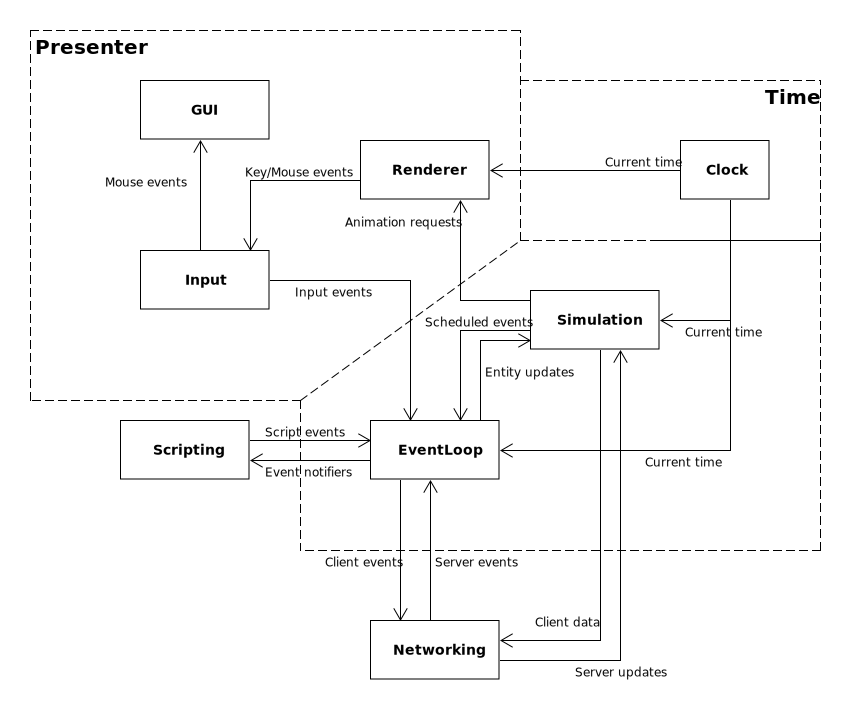

# openage architecture

openage is separated into many modules ("subsystems").

1. [Overview](#overview)
   1. [Components](#components)
   2. [Utilities](#utilities)
2. [Information flow](#information-flow)
   1. [Current architecture](#current-architecture)
   2. [Goal architecture](#goal-architecture)


## Overview

Some of the components are already implemented, others are not.
All of them need to be revisited to implement the goal architecture.


### Components

* Audio system
* Configuration system
* [Coordinate system](coordinate-systems.md)
* [Converter](converter/)
* [Input system](input/)
* Networking
* [Game data database](/doc/nyan/)
* [Rendering](renderer/)
* [Simulation](game_simulation/)
* [Time management](time.md)
* [User interface](gui.md)


### Utilities

* Datastructures
  * [Curves](curves.md)
* [Error handling](exceptions.md)
* Filesystem abstraction
* Job dispatching
* Live reloading
* [Logging system](logger.md)
* [Python interface](pyinterface.md)
* Random number generator
* [Test and demo infrastructure](testing.md)


## Information flow

### Current architecture

The current data flow of openage is just to display the raw simulation data.



The presenter, simulation, and time subsystems each run in a loop in their own threads.
They are largely decoupled from each other and only communicate via defined interfaces.

Communication between all subsystems forms a larger *main* loop that encompasses everything
happening in an engine run. It's workflow is roughly like this:

```
renderer (window system) -> input -> event system -> simulation -> renderer -> output
```

openage does not have simulation steps or *ticks* since everything in the simulation is
event-based and scheduled by time. Therefore, updates between threads should generally work
asynchronously.

Decoupling allows us to treat some subsystems as optional such as the renderer and input
system (basically everything from the presenter).


### Goal architecture

The goal architecture extends the current workflow by subsystems for networking and
scripting:



Both of these are supposed to be decoupled and optional. The current architecture can be extended
by adding the missing components in between.

Networking forwards the relevant events and simulation parameters during multiplayer.
We will have a single authoritative server that is also running the simulation asynchronously.
Each client then receives the data visible for it.

Scripting extends the event system with external sources targets for events. Most
scripting should be integrated using event logic.

The new workflow would then look something like this:

```
                                          ---------> scripting
                                          |             ^
                                          |             |
                                          v             v
renderer (window system) -> input -> event system -> simulation -> renderer -> output
                                          ^             ^
                                          |             |
                                          |             v
                                          ---------> network
```
