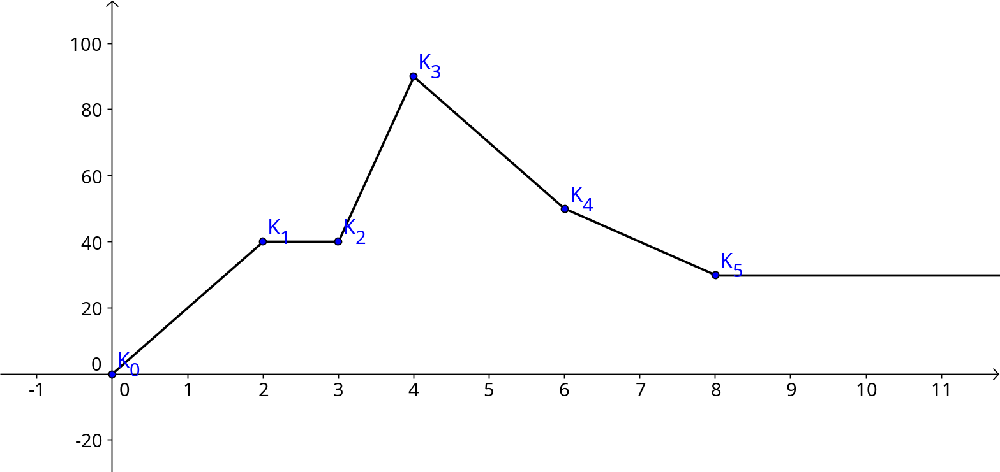
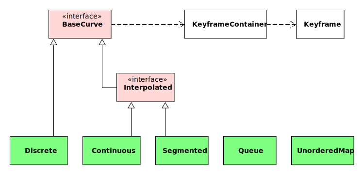
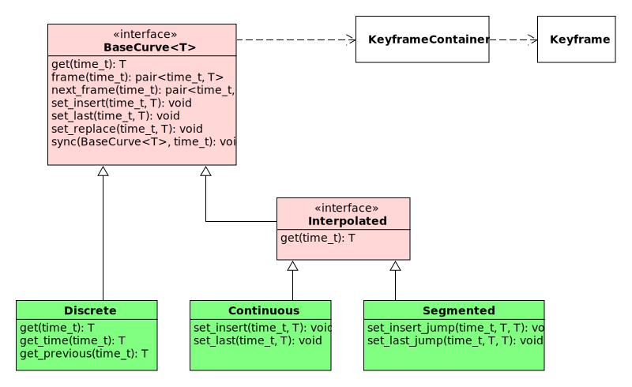
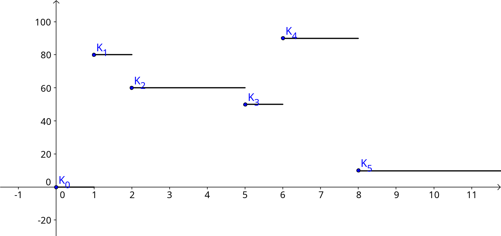
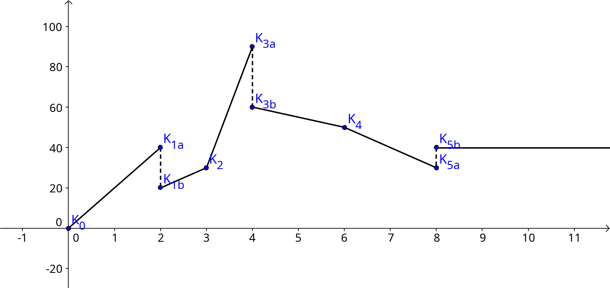

# Curves

*Curves* are data structures that manage changes to data over time. More precisely,
they do not only store data but time-value pairs (keyframes) that allow the retrieval
of a curve data value for any point in time.

Curves are an integral part of openage's event-based game simulation.

1. [Motivation](#motivation)
2. [Architecture](#architecture)
3. [Curve Types](#curve-types)
   1. [Primitive](#primitive)
      1. [Common Operations](#common-operations)
      2. [Discrete](#discrete)
      3. [Continuous](#continuous)
      4. [Segmented](#segmented)
   2. [Container](#container)
      1. [Queue](#queue)
      2. [Unordered Map](#unordered-map)
      3. [Array](#array)

## Motivation

The openage curve structures are inspired by a [similar implementation](https://www.forrestthewoods.com/blog/tech_of_planetary_annihilation_chrono_cam/#.lmxbu3vld) from the game Planetary Annihilation.

Curves intend to solve synchronicity problems in games. In traditional implementations
like lockstep, data is changed incrementally in regular intervals (ticks). Keeping
these changes and the overall gamestate consistent/in sync over network or across threads
is very important, as one missing change can result in a desync of the entire simulation.
Recovering from a desync can also be very hard.

In comparison, simulation with curves allows both async operations and an easier recovery
from desync states. Data is not changed incrementally but is instead calculated using
*keyframe interpolation*. In other words, changes to data are treated as keyframes on
a timeline with in-between values being interpolated from adjacent keyframes.

Additionally, curves cannot only access values for the current simulation time but also for
any past or even future times. Keyframes can also be inserted for any point in time without
directly invalidating the state, making curves more reliable in async scenarios (although
resolving dependencies for keyframes in the past can still be challenging).

The usage of curves has a few downsides though. They are less space efficient due to the
keyframe storage, interpolation are more costly than incremental changes, and
their integration is more complex than the usage of simpler data structures. However, in
situations where operations are predictable, long-lasting, and easy to calculate - which
is the case for most RTS games - the positives may outweigh the downsides.

## Architecture

openage provides several curve types with different interpolation behaviour that each have
their specific use case. Primitive data types are covered by the `BaseCurve` interface
and its derivates of which the `Discrete`, `Continuous`, and `Segmented` are the practically
usable types. For containers, there are classes for `Queue` and `UnorderedMap` available.
All curve types are templated, so that they can store any type of value (with some constraints).
The usable types are explained in more detail in the [Curve Types](#curve-types) section.

Keyframes are implemented as time-value pairs by the `Keyframe` class. `KeyframeContainer`
is used by all curves to manage their keyframe storage. It also provides functionality to
efficiently access and insert keyframes as wel as sorting them by time. For the time
type, the [simulation time type](/doc/code/time.md) from the `openage::time` namespace is
used.

It should be noted that curves are not useful in every situation as keyframe insertion,
interpolation, and searching keyframes based on time create significant overhead. Curves
should be used for variables or members where

* data values must be tracked over time (e.g. HP of a game entity), or
* data values are not modified/read very often (e.g. not every frame), or
* data values are supposed to be sent over the network.

This is usually the case for all game data in [game entity components](/doc/code/game_simulation/components.md)
inside the game simulation.

Curves should generally not be used for variables or members where

* data values are not tracked over time (e.g. for temporary variables), or
* data values are modified/read very often (e.g. in the rendering loop), or
* data values don't affect the simulation state (e.g. visual settings).

## Curve Types

This section provides an overview over the available curves types.

### Primitive

Primitive curves are intended for members with single value types. These include, for example,
the primitive C++ types (e.g. `int`, `float`, `std::string`), simple structs and data classes,
and shared pointers.

On contruction of a primitive curve object, a keyframe with time `t = time::time_t::min_value()`
and the value's type is instanciated with its default constructor. This is done to ensure that for any
requested time `t`, there is always a valid value to be returned. This mirrors the expected
behaviour from declaring primitive values in C++ where members may be auto-initialized without
explicit assignment to a default value. The default value for curves can also be explicitely
assigned in the constructor. Types that don't have a default constructor require that a
default value is passed to the curve constructor.

`BaseCurve` objects can be targeted by or trigger events from the [event system](/doc/code/event_system.md).
As a consequence, curves are not copy constructable as they require a unique ID for
event management. However, it is possible to copy the keyframes of one curve to
the other using the `sync(..)` method. `sync(..)` also works for curves with different
values types if a converter function from one value type to the other is supplied.

#### Common Operations

All primitive curves support the following operations. They may work slightly different
for specific curve types.

**Read**

Read operations retrieve values for a specific point in time.

| Method          | Description                                                 |
| --------------- | ----------------------------------------------------------- |
| `get(t)`        | Get (interpolated) value at time `t`                        |
| `frame(t)`      | Get the previous keyframe (time and value) before or at `t` |
| `next_frame(t)` | Get the next keyframe (time and value) after `t`            |

**Modify**

Modify operations insert values for a specific point in time.

| Method                  | Description                                                                       |
| ----------------------- | --------------------------------------------------------------------------------- |
| `set_insert(t, value)`  | Insert a new keyframe value at time `t`                                           |
| `set_last(t, value)`    | Insert a new keyframe value at time `t`; delete all keyframes after time `t`      |
| `set_replace(t, value)` | Insert a new keyframe value at time `t`; remove all other keyframes with time `t` |

**Copy**

Copy operations transfer keyframes from one curve to another.

| Method           | Description                                                                                      |
| ---------------- | ------------------------------------------------------------------------------------------------ |
| `sync(Curve, t)` | Replace all keyframes from self after time `t` with keyframes from source `Curve` after time `t` |

#### Discrete

Discrete curves implement **constant interpolation** between keyframes. This means
that the value returned by `get(t)` is always equal to the value of the previous
keyframe.

Discrete curves should be used for values that only change at specific points in time,
e.g. for the health of a game entity.

#### Continuous

Continuous curves implement **linear interpolation** between keyframes. This means
that the value returned by `get(t)` is calculated from the value difference
between the keyframes before and after `t`. If there is no keyframe after `t`,
the value of the previous keyframe is used (like on discrete curves).

Value types on continuous curves need to implement methods for the `operator*(..)` and
`operator-(..)` operations to support linear interpolation. In particular, `operator*(..)`
must support multiplication with `time::time_t` and `operator-(..)` must support
substraction for values of the same type.

Continuous curves do not allow jumps between keyframe values (hence "continuous").
Therefore, there cannot be two keyframes inserted for the same time `t`.

Continuous curves should be used for values that change gradually over time,
e.g. a game entity's position or the construction progress of a building.

#### Segmented

Segmented curves implement **linear interpolation** between keyframes and additionally
allow jumps between keyframe values. As with continuous curves, the value returned by `get(t)`
is calculated from the value difference between the keyframes before and after `t`.

Jumps are inserted using the special methods `set_insert_jump(..)` and `set_last_jump(..)`:

| Method                               | Description                                                                       |
| ------------------------------------ | --------------------------------------------------------------------------------- |
| `set_insert_jump(t, value1, value2)` | Insert a two new keyframes at time `t`: `(t, value1)` and `(t, value2)`           |
| `set_last_jump(t, value1, value2)`   | Insert a two new keyframes at time `t` like above; delete all keyframes after `t` |

Segmented curves should be used for values that change gradually but are not on
connected intervals. Typically, this are values that wrap around at some point,
e.g. angles between 0 and 360 degrees.

### Container

Container curves are intended for storing changes to collections and containers.
The currently supported containers are `Queue`, `UnorderedMap` and `Array`.

The most important distinction between regular C++ containers and curve containers
is that curve containers track the *lifespan* of each element, i.e. their insertion time,
modification time, and erasure time. Erasing elements also does not delete them from memory
and instead hides them for requests made after the erasure time.

#### Queue

Queue curve containers are the equivalent to the `std::queue` C++ containers. As such, they
should be used in situations where first-in-first-out (FIFO) access patterns are desired.

Elements in the queue are sorted by insertion time. The element with the earliest insertion time
is the *front* element of the queue.

The front element at time `t` can be read via the `front(t)` method, which retrieves the first,
non-erased element with insertion time before or at `t`. In comparison, `pop_front(t)` returns
the same value as `front(t)` and additionally erases the element from the queue at time `t`.

It should be stressed again that erasing an element does not delete it from memory but
simply ends its lifespan inside the curve container. `front(t)` and `pop_front(t)` always
consider elements with an active lifespan (i.e. elements that are not erased at time `t`).
As a side effect, `pop_front(t1)` and `front(t2)`/`pop_front(t2)` may return the same element
when `t2 < t1` because the element has not ended its lifespan at time `t2` yet. It is in
the responsibility of the caller to ensure that this behaviour does not cause any
side effects.

**Read**

Read operations retrieve values for a specific point in time.

| Method     | Description                             |
| ---------- | --------------------------------------- |
| `front(t)` | Get front element at time `t`           |
| `empty(t)` | Check if the queue is empty at time `t` |

**Modify**

Modify operations insert values for a specific point in time.

| Method             | Description                                            |
| ------------------ | ------------------------------------------------------ |
| `insert(t, value)` | Insert a new element at time `t`                       |
| `pop_front(t)`     | Get front element at time `t` and erase it at time `t` |
| `clear(t)`         | Erase all elements inserted before time `t`            |

#### Unordered Map

Unordered map curve containers store key-value pairs while additionally keeping
track of element insertion time. Requests for a key `k` at time `t` will return the value
of `k` at that time. The unordered map can also be iterated over for a specific time `t` which
allows access to all key-value pairs that were in the map at time `t`.

#### Array

Array curve containers store a fixed number of `n` elements where `n` is determined at compile-time.
They are the curve equivalent to the `std::array` C++ containers. In comparison to `std::array` each
element in the array curve container is tracked individually over time. Hence, each index is associated
with its own `KeyframeContainer` whose keyframes can be updated independent from other indices.
When a value is added to the `Array` curve at a given index, a new keyframe is added to the respective
`KeyframeContainer` stored at that index.

**Read**

Read operations retrieve values for a specific point in time.

| Method             | Description                                                              |
| ------------------ | ------------------------------------------------------------------------ |
| `get(t, i)`        | Get value of element at index `i` at time <= `t`                         |
| `get(t)`           | Get array of values at time <= `t`                                       |
| `size()`           | Get the number of elements in the array                                  |
| `frame(t, i)`      | Get the previous keyframe (time and value) at index `i` before or at `t` |
| `next_frame(t, i)` | Get the next keyframe (time and value) at index `i` after `t`            |

**Modify**

Modify operations insert values for a specific point in time.

| Method                     | Description                                                                                |
| -------------------------- | ------------------------------------------------------------------------------------------ |
| `set_insert(t, i, value)`  | Insert a new keyframe(`t`, `value`) at index `i`                                           |
| `set_last(t, i, value)`    | Insert a new keyframe(`t`, `value`) at index `i`; delete all keyframes after time `t`      |
| `set_replace(t, i, value)` | Insert a new keyframe(`t`, `value`) at index `i`; remove all other keyframes with time `t` |

**Copy**

| Method           | Description                                                                                      |
| ---------------- | ------------------------------------------------------------------------------------------------ |
| `sync(Curve, t)` | Replace all keyframes from self after time `t` with keyframes from source `Curve` after time `t` |
