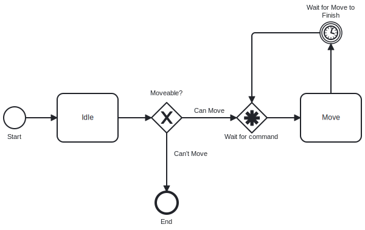

# Activity Control Flow

The *activity control flow* is openage's method to make complex game entity behaviour
configurable.

1. [Motivation](#motivation)
2. [Architecture](#architecture)
3. [Node Types](#node-types)

## Motivation

Unit behaviour in RTS games can get very complex. In many cases, units are not
just controlled by commands but other automated mechanisms, e.g. attacking enemy
units in the line of sight. Furthermore, commands do not always translate to a single
well-defined action. For example, an attack command usually results in a move action
and a subsequent attack action. Some commands may even execute different actions depending
on context.

All this means that we cannot view the control flow of a unit as a simple mapping of
command to action as is done in other games. Instead, we have to treat unit behaviour
as a complex chain of actions with branching paths, wait states for events, triggers
and feedback loops. Unless we want every command to be a hardcoded action chain, managing
this complexity is key to making unit behaviour configurable.

## Architecture

Game entity control flows in openage are modelled as directed node graph, so-called *activities*.
Nodes in the graph correspond to actions that execute for the game entity or conditional queries
and event triggers that indicate which path to take next. By traversing the node graph along
its paths, the game entities actions are determined. The currently visited node in the graph
corresponds to the current action of a unit.

Activities are reusable, i.e. they are intended to be shared by many game entities Usually,
all game entities of the same type should share the same behaviour, so they get assigned
the same activity node graph.

An activity can also be represented visually like this:

The design is heavily inpired by the [BPMN](https://en.wikipedia.org/wiki/Business_Process_Model_and_Notation)
representation. You don't need to know BPMN to understand the activity control flow because
we explain everything important about the graphs in our documentation. However,
you can use available [BPMN tools](https://bpmn.io/) to draw activity node graphs.

## Node Types

| Type             | Inputs | Outputs | Description               |
| ---------------- | ------ | ------- | ------------------------- |
| `START`          | 0      | 1       | Start of activity         |
| `END`            | 1      | 0       | End of activity           |
| `TASK_SYSTEM`    | 1      | 1       | Run built-in system       |
| `TASK_CUSTOM`    | 1      | 1       | Run custom function       |
| `XOR_EVENT_GATE` | 1      | 1+      | Wait for event and branch |
| `XOR_GATE`       | 1      | 1+      | Branch on condition       |
