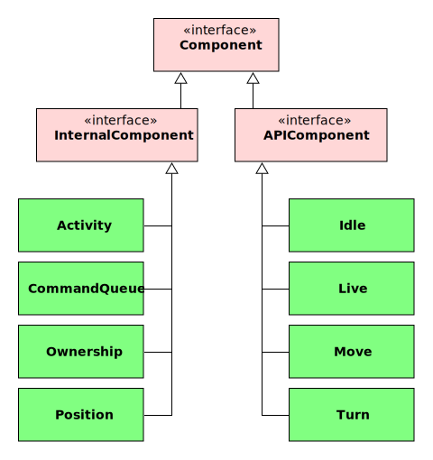
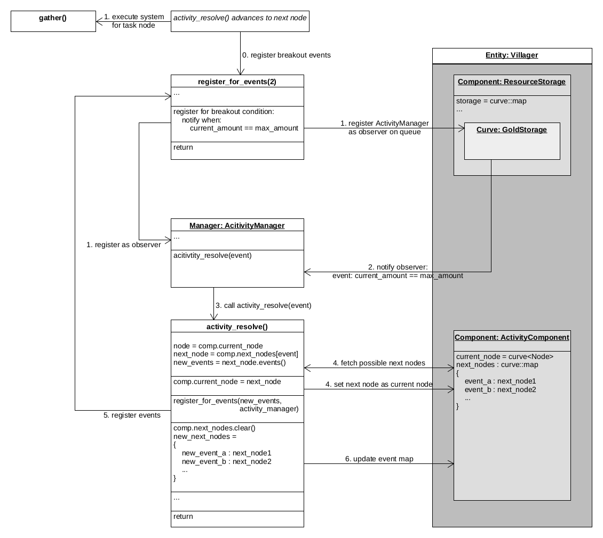

# Game Entity

Game entities represent objects inside the game world.

1. [Architecture](#architecture)
2. [Game Entity class](#game-entity-class)
3. [Component Data Storage](#component-data-storage)
4. [Control Flow](#control-flow)
   1. [System](#system)
   2. [Activities](#activities)
   3. [Manager](#manager)

## Architecture

Game entity mechanics are structured using the concept of *separation of concerns*.
This means that there is not one single `GameEntity` class that implements all data
and game logic. Instead, data and logic are separated into distinct engine components
that each have a dedicated, clearly-defined purpose.

Data storage is handled by `Component` objects that manage references to the [nyan](/doc/nyan/nyan.md)
database and store runtime data on [curves](/doc/code/curves.md). Game logic is implemented
in *systems*, which are best described as independent functions that perform a specific action
on an entity. Event handling is done by the `GameEntityManager` which initiates and directs
the entity's individual control flow.

It should be noted that while the terminology we use here is very similar to names
in the *Entity-Component-System* (ECS) architecture, you shouldn't think of the openage
game simulation as a traditional ECS-driven architecture. We merely use this terminology
because we can't think of anything better (and because we are too lazy to find better names).

## Game Entity class

The `GameEntity` class primarily provides references to the game entity's unique ID, assigned
components, and event handling manager. If the game entity is supposed to be animated,
a [render entity](/doc/code/renderer/level2.md#updating-render-stages-from-the-gamestate)
can also be set. This allows requesting animations for the game entity.

`GameEntity` follows the principle of *composition over inheritance*. Therefore, capabilities
and attributes of a game entity are defined by the assigned components rather than properties
of its class. The `GameEntity` class is merely a thin wrapper with a reference ID for
a set of components storing the actual data (via `Component` subclasses). Components
of the specific entity can be accessed via the `GameEntity` object's `get_component(..)` method.

## Component Data Storage

For a description of the available components, check the [component reference](components.md).

Components are data storage objects for a game entity that also perform the dual role
of signifying what a game entity can do or is depending on their component type. Component
types are usually associated with a subclass of `Component`, e.g. `Move`. For example, assigning
a `Move` component to a game entity signifies that the game entity can perform move
actions during gameplay. Movement data relevant to the game entity is then also stored in this
component object.

In general, component classes are designed to be atomic, i.e. they don't depend on other
components to be assigned to the game entity. While some components may have a close relationship,
e.g. `Move` and `Position`, it should never be assumed that all components are assigned
when operating on a game entity.

Persistent game data, i.e. data that is the same in every game like unit stats, is not
managed by the component itself but in the game's [nyan](/doc/nyan/nyan.md) database. The component
only holds a reference to the nyan object associated with the component. Data from nyan
must be fetched via the [openage nyan interface](/doc/nyan/openage-lib.md).
Component types usually have a corresponding nyan object type in the nyan API, e.g. the `Move`
component corresponds to the `engine.ability.type.Move` nyan type.

Runtime data, i.e. data that changes due to gameplay interactions, is stored on [curves](/doc/code/curves.md)
managed by the component object. Curves are keyframe-based time-value storages that track
changes to the data over time. Components can provide helper methods to interact with
the curve, e.g. `Position` provides `set_position` to insert a new keyframe on its
`position` data curve.

## Control Flow

The control flow is organized into 3 core mechanisms: Systems, activities, and
managers. This again tries to achieve a *separation of concern* design to
make the game logic maintanable and extensible.

### System

For a description of the available systems, check the [system reference](systems.md).

A *system* in openage is basically a function that operates on game entity
components. They are explicitely separated from game entity and component objects
to allow for more flexible implementation. In practice, systems are implemented as static
functions inside the `gamestate::system` namespace.

Systems are *stateless*, so they don't remember anything about the game entity
components they operate on. If something about the execution state should be remembered,
it needs to be stored in a component. Additionally, system execution is always
immediate. This means that a system never waits for events or for a certain amount
of time. Waiting is handled by the [game entity manager](#manager) and the
[activity control flow](#activities) instead.

When adding new systems to the engine, interdependencies to other systems should
be avoided at all cost, i.e. a system should never call another system directly.
Exceptions should only be made for direct subsystems implementing subroutines
or to avoid code redundancies. The reasoning behind this is that dependencies
between systems may quickly become unmanageable.

### Activities

*Activities* connect systems together in a node graph to describe the overall control flow
for a game entity. In openage, activity node graphs are used to model the complex behaviour
behaviour and action chains of RTS game entities, while also allowing the behaviour to
be as configurable as possible. One could also think of activities as a behaviour graph
where paths are taken based on the inputs a game entity receives. The architecture
of the activity control flow is described in more detail in the
[activity control flow documentation](activity.md).

A game entity's current activity state is stored in its `Activity` component. This component
holds a reference to the activity node graph used by the entity as well as the
last visited node. This node describes which action/behavioural state the
game entity currently is in.

Advancement to the next node can be initiated in several ways, depending on the
[node type](activity.md#node-types) of the current node.
It can happen automatically or be triggered by an event. In the latter case,
the event is handled by the `GameEntityManager` which calls an activity *system*
that processes the event to choose the next node.

### Manager

The game entity listens for events that target the entity and takes the
associated action depending on the event type.
