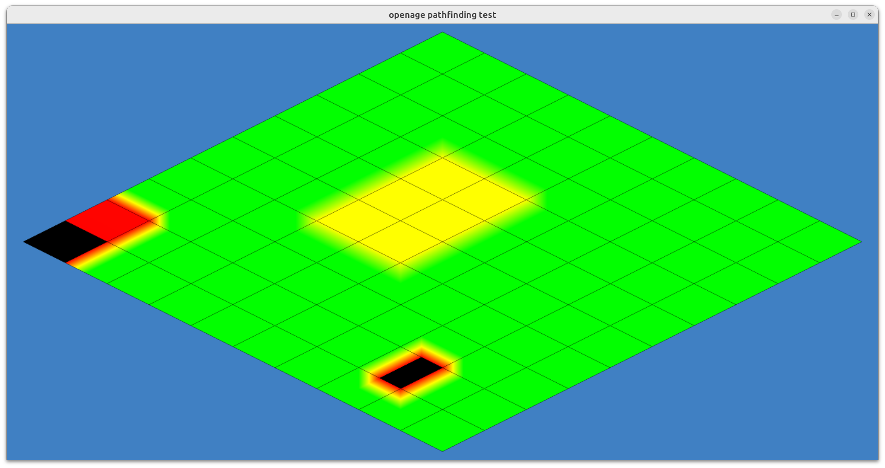
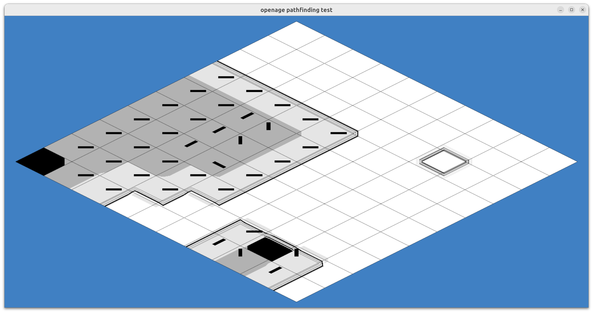

# Field Types

This document describes the field types used in the flow field pathfinding system.

Most of the descriptions are based on the [*Crowd Pathfinding and Steering Using Flow Field Tiles*](http://www.gameaipro.com/GameAIPro/GameAIPro_Chapter23_Crowd_Pathfinding_and_Steering_Using_Flow_Field_Tiles.pdf) article by Elijah Emerson.

## Cost Field

A cost field is a square grid of cells that record the cost of movement on the location
of each cell. Higher cost values indicate that it is less desirable to move through that cell.
The field is usually initialized at the start of the game and persists for the lifetime of
the entire pathfinding grid. During gameplay, individual cell costs may be altered to reflect
changes in the environment.

Cost values are represented as `uint8_t` (0-255) values. The range of usable cost values
is `1` to `254`. `255` is a special value that represents an impassable cell. `0` is reserved
for initialization and should not be used for flow field calculations.

- **green**: minimum cost
- **red**: maximum cost
- **black**: impassable cell

## Integration Field

The integration field is created from a cost field when a path is requested. For a specific
target cell, the integration field stores the accumulated cost of reaching that cell from
every other cell in the field.

Integration values are calculated using a wavefront algorithm. The algorithm starts at the
target cell(s) and propagates outward, updating the integration value of each cell it visits.
The integration value is calculated by adding the cost value of the current cell to the lowest
integration value of the 4 cardinal neighbors. The integration value of the target cell(s) is `0`.

Integration values are represented as `uint16_t` (0-65535) values. The range of usable integration
values is `1` to `65534`. `65535` is a special value that represents an unreachable cell. During
initialization, all cells are set to `65535`.

An additional refinement step in the form of line-of-sight testing may be performed before the
integration values are calculated. This step flags every cell that is in line of sight of the
target cell. This allows for smoother pathing, as game entities can move in a straight line to
the target cell. The algorithm for this step is described in more detail in section 23.6.2
of the [*Crowd Pathfinding and Steering Using Flow Field Tiles*](http://www.gameaipro.com/GameAIPro/GameAIPro_Chapter23_Crowd_Pathfinding_and_Steering_Using_Flow_Field_Tiles.pdf) article.

In addition to the integration values, the integration field also stores flags for each cell:

- `FOUND`: cell has been visited
- `TARGET`: cell is a target cell
- `LOS`: cell is in line of sight of target cell
- `WAVEFRONT_BLOCKED`: cell is blocking line of sight to target cell

- **green**: lower integration values
- **purple**: higher integration values
- **black**: unreachable cell

## Flow Field

Creating the flow field is the final step in the flow field calculation. The field
is created from the integration field. Cells in the flow field store the direction to
the neighbor cell with the lowest *integrated* cost. Thus, directions create a "flow"
towards the target cell. Following the directions from anywhere on the field will lead
to the shortest path to the target cell.

Flow field values are represented as `uint8_t` values. The 4 least significant bits are used
to store the direction to the neighbor cell with the lowest integrated cost. Therefore, 8
directions can be represented. The 4 most significant bits are used for flags:
- `PATHABLE`: cell is passable
- `LOS`: cell is in line of sight of target cell
- `TARGET`: cell is a target cell

- **white**: line of sight
- **bright/dark grey**: passable cells (not in line of sight)
- **black**: impassable cell
