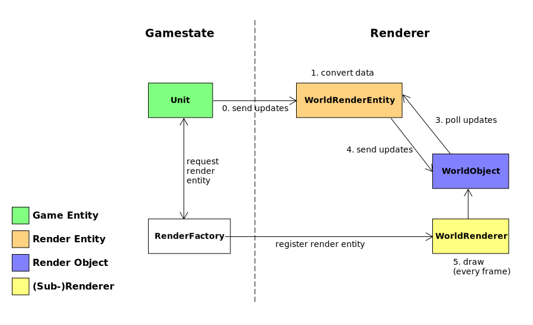
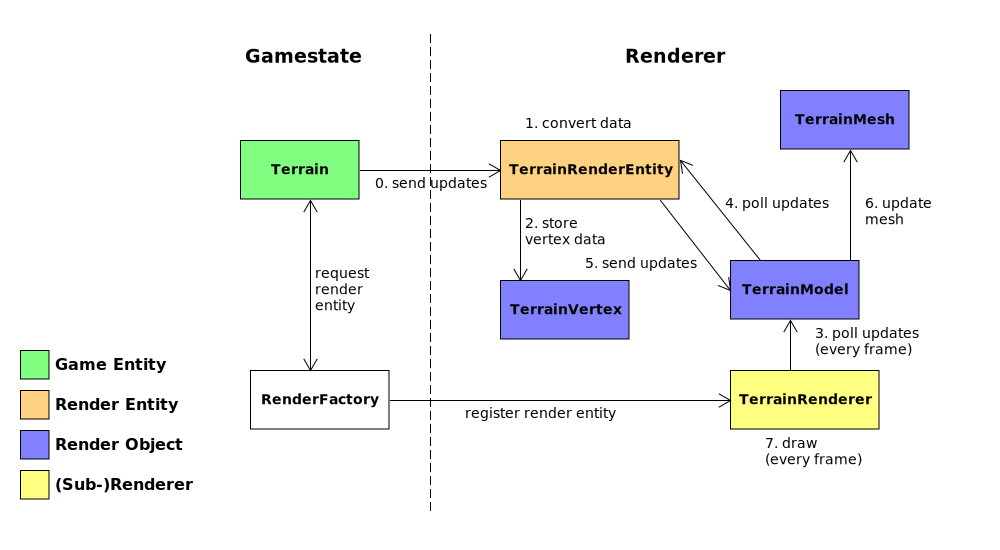

# Level 2

High-level renderer for transforming data from the gamestate to render objects for the level 1 renderer.

## Overview

1. [Overview](#overview)
2. [Stages](#stages)
   1. [Updating Render Stages from the Gamestate](#updating-render-stages-from-the-gamestate)
3. [Camera](#camera)
   1. [Frustum Culling](#frustum-culling)

## Stages

Every stage has its own subrenderer that manages a `RenderPass` from the level 1 renderer and updates it with `Renderable`s created using update information from the gamestate. Stages also store the vertex and fragment shaders used for drawing the renderable objects.

There are currently 6 stages in the level 2 rendering pipeline:

1. `SkyboxRenderer`: Draws the background behind the terrain (as a single color).
1. `TerrainRenderer`: Draws the terrain. Terrains are handled as textured 3D meshes.
1. `WorldRenderer`: Draws animations and sprites for units/buildings and other 2D ingame objects.
1. `HudRenderer`: Draws "Head-Up Display" elements like health bars, selection boxes, and others.
1. `GuiRenderer`: Draws the GUI overlay. The drawing part in this stage is actually done by Qt, while the level 1 renderer only provides the framebuffer.
1. `ScreenRenderer`: Alpha composites the framebuffer data of previous stages and draws them onto the screen (i.e. it overlays the outputs from the other stages).

With the exception of the `ScreenRenderer`, all stages are independent from each other, i.e. the order in which they are rendered each frame does not matter. To render the current frame for a stage, call its `update()` method. The `ScreenRenderer` must be rendered last as it combines the output of all other stages into the result shown on screen.

### Updating Render Stages from the Gamestate

Gamestate (game simulation) and level 2 rendering are largely decoupled, i.e. communication between these components only happens via a few dedicated connection interfaces in the codebase. Furthermore, the information flow between gamestate and renderer is strictly one-way (always gamestate -> renderer). In practice, this means that the gamestate constantly updates the level 2 renderer on what it should display. The renderer only acts on what it receives from the gamestate and does not actively request or send information to the gamestate. We mainly do this for thread-safety reasons as gamestate and renderer live in two different threads at runtime.

There are two render stages that can receive updates from the gamestate: `WorldRenderer` and `TerrainRenderer`. You can see how updates are propagated from the gamestate to these stages here:

| **WorldRenderer**                           | **TerrainRenderer**                             |
| ------------------------------------------- | ----------------------------------------------- |
|  |  |

As you can see, the workflow for both render stages is roughly the same and involves these components:
  - **game entity**: Object in the game world managed by the gamestate, e.g. a unit or a building.
  - **render entity**: Connector object between game entity and the render stage. The game entity sends updates to the render entity to communicate what should be displyed. Furthermore, the render entity transforms said updates into something usable by the renderer, e.g. loading the texture for a texture ID. Render entities also contain the critical path between the gamestate and renderer thread boundaries.
  - **render object(s)**: Store the current render state for a `Renderable` created for a render entity, e.g. uniforms, meshes or IDs. There can be a variable number of these objects depending on the complexity of the render state. For example, the `TerrainRenderer` stage has separate objects for the mesh (`TerrainMesh`) and model (`TerrainModel`) for its terrain. Render objects poll the render entity for updates every frame and may change the render state when updated.
  - **(sub-)renderer**: Manages all render objects for the render stage, i.e. by polling them for updates and creating level 1 `Renderable`s from their render state which are added to the stage's render pass. New render entities are also registered at the subrenderer. Upon registration, the subrenderer creates the necessary render objects and attaches them to the render entity.
  - **render factory**: Factory in the gamestate for creating and registering new render entities. Game entities can request render entities from the factory, which then also registers the render entity at the corresponding subrenderer. The render factory lives in the gamestate thread, but crosses thread boundaries when registering new render entities. Therefore, it is also part of the critical path.

## Camera

What parts of the scene is shown on screen is controlled by the `Camera` class. The camera is handled like an object in the rendered 3D scene that determines what is displayed depending on its position, zoom level and angle. Position and zoom level of the camera can be changed at runtime, while the angle is fixed to the dimetric/isometric view used in Age of Empires games. More precisely, the camera has a yaw of `-135` degrees and a pitch of `-30` degrees (pointed in the `(-x, -y, -z)` direction in the OpenGL coordinate system). The projection method used by the camera is orthographic projection.

The `Camera` class provides the following methods for positioning the camera in the scene:

- `move_to(...)`: Move to a specific scene position.
- `move_rel(...)`: Move relative to the position using a direction vector. This is usually used to move the camera with key presses or mouse movements.
- `look_at_scene(...)`: Point the camera on a position in the scene. This will move the camera in such a way that the target position is in the center of the viewport.
- `look_at_coord(...)`: Same as `look_at_scene(...)` but using openage's `coord::scene3` coordinates as input.

Zoom levels can also be adjusted with these methods:

- `set_zoom(...)`: Set the zoom level to an absolute value. Values <1.0f zoom the camera in, while values >1.0f zoom the camera out.
- `zoom_in(...)`: Let the camera incrementally zoom in.
- `zoom_out(...)`: Let the camera incrementally zoom out.

For displaying 3D objects, the `Camera` can also calculate a view matrix (`get_view_matrix()`) and projection matrix (`get_projection_matrix()`) that take current position and zoom level into account.

Camera parameters may be used for raycasting operations, e.g. mouse picking/selection. Since the camera utilizes orthographic projection and a fied angle, the ray direction is exactly the same as the camera direction vector (accessible as `cam_direction`). To find the origin point of a ray for a pixel coordinate in the viewport, the `get_input_pos(..)` method can be used. This method calculates the position of the pixel coordinate on the othographic camera plane that represents the viewport. The result is the absolute position of the pixel coordinate inside the 3D scene. Ray origin point and direction can then be used to perform calculations for line-plane or line sphere intersections.

### Frustum Culling

Frustum culling is a technique used to discard objects that are outside the view frustum of the camera.
This can save a lot of computation time that would be spent on updating shaders and rendering objects
that are not visible in the camera's view.

The openage renderer provides two frustum types: 2D and 3D frustums. 2D frustums are used
for sprite animations and other 2D objects, while 3D frustums are used for 3D objects. Both frustums
can be created from a camera object.

```c++
std::shared_ptr<Camera> camera = std::make_shared<Camera>(renderer, {800, 600});

Frustum2d frustum_2d = camera->get_frustum_2d();
Frustum3d frustum_3d = camera->get_frustum_3d();
```

`Frustum2d` and `Frustum3d` provide a method `is_visible(..)` that can be used to check if an object is
located inside the frustum. The required inputs differ depending on the frustum type. For 3D frustums,
only the 3D scene position is required:

```c++
bool is_visible = frustum_3d.is_visible({0.f, 0.f, 0.f});
```

For 2D frustums, in addition to the 3D scene position, a model matrix, the animation's scalefactor
as well as the bounding box of the animation must be provided.

```c++
bool is_visible = frustum_2d.is_visible(
  {0.f, 0.f, 0.f},
  model_matrix, // the model matrix of the animation
  scalefactor, // how much the animation is scaled
  {10, 20, 50, 10} // max distance from the center to the edges of the bounding box
);
```
