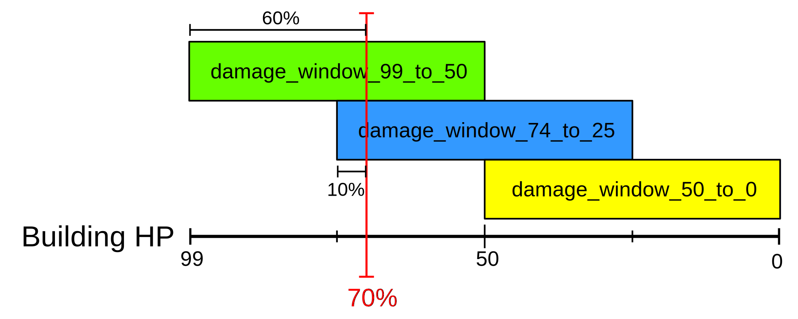

# SMP Files

SMP files are the successor format to SLP files. Like SLP files,
they contain animations, shadows and outlines for units. SMPs
were introduced with Age of Empires 2: Definitive Edition.

The Age of Empires 2: Definitive Edition almost exclusively stores
sprites in a compressed version of the format that is called SMX.
You can read more about SMX files [here](smx-files.md).

## SMP File Format

SMPs share a lot of structural similarities to SLPs. However,
all of the drawing commands have changed, so the formats are not
compatible to each other.


### Header

The SMP file starts with a header:

Length   | Type   | Description          | Example
---------|--------|----------------------|--------
4 bytes  | string | Signature            | SMP$
4 bytes  | uint32 | Version              | 0x00000100
4 bytes  | uint32 | Number of frames     | 721, 0x000002D1
4 bytes  | uint32 | Number of facets     | 1, 0x0000001 (almost always 0x00000001)
4 bytes  | uint32 | Frames per facet     | 721, 0x000002D1
4 bytes  | uint32 | possibly checksum    | 0x8554F6F3
4 bytes  | uint32 | File size in bytes   | 0x003D5800
4 bytes  | uint32 | Source format        | 0x0B (SLP) or 0x0C (PSD)
32 bytes | string | Comment              | Apparently the file path on FE's machines


```cpp
struct smp_header {
  char   signature[4];
  uint32 version;
  uint32 num_frames;
  uint32 num_animations;
  uint32 frames_per_animation;
  uint32 checksum;
  uint32 file_size;
  uint32 source_format;
  char   comment[32];
};
```
Python format: `Struct("< 4s 7I 32s")`

Remarks:

* *Source format* refers to the format of the file used as input for the
official asset conversion tool `DEAssetTool.exe` when creating the SMP.

### SMP Frame Offsets

SMP frames can have up to 3 layers.

* main graphic layer
* shadow layer (optional)
* outline layer (optional)

After the file header, there are `num_frames` entries of `smp_frame_offset`.
Every `smp_frame_offset` stores the offset to a frame within the SMP
file.

```cpp
struct smp_frame_offset {
  uint32 offset;
}
```
Python format: `Struct("< I")`


### SMP Frame Header

At every `smp_frame_offset` there is a 32 bytes long frame header
that stores the number of layers for the frame in a 4 byte length
field at the end.

```cpp
struct smp_frame_header {
  28 bytes unused; # stores frame header info for source_format = 0x0B
  uint32   length;
}
```

SMPs converted from SLPs (source format 0x0B), the frame header has
the same structure as the layer headers (see below), except that
`outline_table_offset` and `cmd_table_offset` are set to zero.
For SMPs created from PSD files, all fields except the length field
are set to zero.


### SMP Layer Header

After the frame header, there are `length` entries of `smp_layer_header`.
These struct are similar to the SLP Frame Info struct in that they store
metadata about the frame.

Length   | Type   | Description                | Example
---------|--------|----------------------------|--------
4 bytes  | uint32 | Width of image             | 168, 0x000000A8
4 bytes  | uint32 | Height of image            | 145, 0x00000091
4 bytes  | uint32 | Centre of sprite (X coord) | 88, 0x00000058
4 bytes  | uint32 | Centre of sprite (Y coord) | 99, 0x00000063
4 bytes  | uint32 | Layer type                 | 0x02, 0x04 or 0x08
4 bytes  | uint32 | Outline table offset       | 600, 0x00000258
4 bytes  | uint32 | Command table offset       | 0, 0x00000000
4 bytes  | uint32 | Flags                      | 0x01, 0x02, 0x80 or 0xA0

```cpp
struct smp_layer_header {
  uint32 width;
  uint32 height;
  uint32 hotspot_x;
  uint32 hotspot_y;
  uint32 layer_type;
  uint32 outline_table_offset;
  uint32 cmd_table_offset;
  uint32 flags;
};
```
Python format: `Struct("< 8I")`

Remarks:

* Layer types can be `0x02` (main graphic), `0x04` (shadow) or `0x08`
(outline). In SMPs with source format 0x0B, outlines use a different layer type: `0x10`.
* Outline and command table offsets **are always relative to the frame offset**.


### SMP Layer Row Edge

At `outline_table_offset` (after the `smp_layer_header` structs), an array of
`smp_layer_row_edge` (of length `height`) structs begins.

Length   | Type   | Description   | Example
---------|--------|---------------|-----------
2 bytes  | uint16 | Left spacing  | 20, 0x0014
2 bytes  | uint16 | Right spacing | 3, 0x0003

```cpp
struct smp_layer_row_edge {
  uint16 left_space;
  uint16 right_space;
};
```
Python format: `Struct("< H H")`

For every row, `left_space` and `right_space` specify the number of transparent
pixels, from each side to the center. For example, in a 50 pixels wide row, with
a `smp_layer_row_edge` of `{ .left_space = 20, .right_space = 3 }`, the leftmost
20 pixels will be transparent, the rightmost 3 will be transparent and there
will be 27 pixels of graphical data provided through some number of commands.

If the right or left value is `0xFFFF`, the row is completely transparent.
Note that there are no command bytes for these rows, so it has to be skipped
"manually".

`width - left_space - right_space` = number of pixels in this line.


### SMP Command Table

At `smp_layer_header.cmd_table_offset`, an array of
uint32 (of length `height`) begins:

```cpp
struct smp_command_offset {
  uint32 offset;
}
```
Python format: `Struct("< I")`

Each `offset` defines the offset (beginning) of the first command of a row.
The first `offset` in this array is the first drawing command for the image.
All offsets are relative to their respective `smp_frame_offset`.

These are not actually necessary to use (but obviously are necessary to read),
since the commands can be read sequentially, although they can be used for
validation purposes.


### SMP Drawing Commands

The image is drawn line by line, a line is finished with the *End of Row*
command (0x03). A command is a one-byte number (`cmd_byte`), followed
by command-specific data with a length (number of pixels) varying
depending on the command. The next command immediately follows the
previous command's data.

In contrast to SLPs, the SMP format uses a much more simplified command set
that only contains four commands: *Skip*, *Draw*, *Player Color Draw*
and *End of Row*. The type of command is stored in the 2 least significant
bits of the command byte. The 6 most significant bytes define the length of the
command.

Each command triggers a drawing method for n = "Count" pixels.

For examples of drawing commands, see the [Examples](#examples) section.


### Full Command List

An `X` signifies that the bit can have any value. These bits are used for
storing the length (pixel count) of the command.

The commands works slightly different for each layer type.


#### Main Graphics type

Command Name     | Byte value    | Pixel Count              | Description
-----------------|---------------|--------------------------|------------
Skip             | `0bXXXXXX00`  | `(cmd_byte >> 2) + 1`    | *Count* transparent pixels should be drawn from the current position.
Draw             | `0bXXXXXX01`  | `(cmd_byte >> 2) + 1`    | An array of length `pixel_count * 4` bytes filled with 4-byte SMP pixels follows (see [SMP Pixel](#smp-pixel))
Playercolor Draw | `0bXXXXXX10`  | `(cmd_byte >> 2) + 1`    | An array of length `pixel_count * 4` bytes filled with 4-byte SMP pixels follows (see [SMP Pixel](#smp-pixel))
End of Row       | `0bXXXXXX11`  | 0                        | End of commands for this row. If more commands follow, they are for the next row.

* When converting the main graphics, the alpha values from the palette are
ignored by the game.


#### Shadow type

Command Name     | Byte value    | Pixel Count              | Description
-----------------|---------------|--------------------------|------------
Skip             | `0bXXXXXX00`  | `(cmd_byte >> 2) + 1`    | *Count* transparent pixels should be drawn from the current position.
Draw             | `0bXXXXXX01`  | `(cmd_byte >> 2) + 1`    | An array of length `pixel_count * 4` bytes filled with 1-byte alpha values follows.
End of Row       | `0bXXXXXX11`  | 0                        | End of commands for this row. If more commands follow, they are for the next row.

* Shadow layers (layer type `0x04`) sometimes do not explicitely draw the last
pixel in a row. If that happens, the openage converter draws the last *Draw* command
again.


#### Outline type

Command Name     | Byte value    | Pixel Count              | Description
-----------------|---------------|--------------------------|------------
Skip             | `0bXXXXXX00`  | `(cmd_byte >> 2) + 1`    | *Count* transparent pixels should be drawn from the current position.
Draw             | `0bXXXXXX01`  | `(cmd_byte >> 2) + 1`    | *Count* player color pixels should be drawn from the current position.
End of Row       | `0bXXXXXX11`  | 0                        | End of commands for this row. If more commands follow, they are for the next row.

* SMP files do not specify a color from a palette for outlines. The openage converter
always uses the color from index 0 in the player color palette for these *Draw* commands.


### SMP Pixel

SMP pixels store a palette index, palette number and section as well
as a modifier for darkening the pixel if the corresponding unit is damaged.

Length   | Type   | Description                | Example
---------|--------|----------------------------|--------
1 byte   | uint8  | Palette index              | 20, 0x0014
1 byte   | uint8  | Palette number and section | 7, 0x0007
2 byte   | uint16 | Damage modifier            | 0x29D0 (bits [0,1] and [12,15] are unused)

```cpp
struct smp_pixel {
  uint8  px_index;
  uint8  px_palette;
  uint16 px_damage_modifier;
};
```
Python format: `Struct("< B B H")`

#### Palette Info

Colors are stored in JASC palettes with 1024 colors. The palettes are assigned an index
which is stored in a `palette.conf` file. To find the encoded color of a SMP pixel,
the *palette index* and *palette section* have to be determined from the `px_palette`
value. The palette index is stored in the 6 most significant bits, while the palette
section is stored in the 2 least significant bits.

```
palette_index = px_palette >> 2

palette_section = px_palette & 0b00000011
```

`px_index` has to be added to `256 * palette_section` to retrieve the actual
index for the palette. This index can then be used to get the color value from
the palette with the index `palette_index`.

#### Damage Info

The last two bytes of the pixel (read with little endian byte order) contain a
modifier value that is internally used to calculate the darkening effect of units.
From this modifier and the current damage percentage, the game internally calculates
a multiplier that is applied to the RGB values of the pixel. More on how that works
is described further below.

The modifier only effectively uses 10 of the uint16's bits (bits with index [2,11]).
Of these 10 bits, the most significant bit seems to be a usage flag that indicates
whether the modifier should be applied to the pixels. The other 9 bits contain the
modifier value. You can calculate the effective value by shifting `px_damage_modifier`
by 4 to the right and then masking with `0x01FF` to get rid of the usage flag.

```
damage_modifier = (px_damage_modifier >> 4) & 0x01FF
```

This yields a value between 0 and 511. From this value, the game creates an
approximation of a [sigmoid curve](https://en.wikipedia.org/wiki/Sigmoid_function)
("S"-shaped curve) that, given the current damage percentage, returns a multiplier
which is then applied to the RGB values of the retrieved palette color. Visually
this means that the darkening effect is small at first, then rapidly increases until 50%
damage has been reached. Afterwards, the increase will slow down until it levels off
at a maximum value.

You can retrieve the multiplier by using this function:

```python
def calculate_rgb_multiplier(damage_modifier, current_damage_percent):
    damage_window_99_to_50 = current_damage_percent * 2
    damage_window_74_to_25 = damage_window_99_to_50 - 0.5
    damage_window_49_to_0 =  damage_window_74_to_25 - 0.5

    damage_window_99_to_50 = min(max(damage_window_99_to_50, 0.0), 1.0)
    damage_window_74_to_25 = min(max(damage_window_74_to_25, 0.0), 1.0)
    damage_window_49_to_0 = min(max(damage_window_49_to_0, 0.0), 1.0)

    a = math.floor(damage_modifier / 64)
    temp = damage_modifier - 64 * a + 0.5
    b = math.floor(temp / 8)
    c = temp - 8 * b

    a = a * damage_window_99_to_50
    b = b * damage_window_74_to_25
    c = c * damage_window_49_to_0

    sigmoid_result = (a + b + c) / 7
    sigmoid_result = min(max(sigmoid_result, 0.0), 0.65)

    rgb_multiplier = 1 - sigmoid_result

    return rgb_multiplier
```

Remarks:

* Pixel's RGB values can at maximum get 65% darker than their original color. This
behaviour is hardcoded into the game and cannot be changed.
* Adding `0.5` to `temp` is not strictly necessary, but will solve problems with
floating point rounding errors.
* The three `damage_window_X_Y` values represent how far health of a building
has gone down relative to a health interval between `X` and `Y` (both representing
percentages of health left). For example, if the building is currently at 70% health,
then we have progressed by 60% in the health interval that monitors 99% to 50% health.
Therefore, `damage_window_99_to_50` would be `0.6`.


#### Examples

##### Retrieving a color value from a SMP pixel

Let's assume we have a single SMP pixel and want to find the correct palette for it.

```
SMP pixel example: 0xEF 0x57 0x50 0x20
```

The second byte value `0x57` contains the palette information.

We can retrieve the *palette index* by shifting `0x57` by 2 to the right. Alternatively,
you can also divide the value by 4 and floor the result.

```
palette_index = 0x57 >> 2 = 0b01010111 >> 2 = 0b00010101 = 21
```

The *palette index* is 21 which maps to the palette `b_west.pal` in the `palettes.conf`
of Age of Empires 2: Definitive Edition.

Now we have to determine the section of the palette that is used  for the pixel. To
do that, we can either look at the 2 most significant or calculate
`px_palette mod 4`.

```
palette_section = 0x57 & 0b00000011 = 0b01010111 & 0b00000011 = 0b00000011 = 3
```

Here, the *palette section* is 3 which would cover the indexes 512 to 767 in
`b_west.pal`. From the retrieved values we can now determine the actual index
in the palette by adjusting `px_index = 0xEF` to the palette section.

```
color_index = px_index + 256 * palette_section
            = 0xEF + 256 * 0x03
            = 239  + 256 * 3
            = 1007
```

Finally, we can use this index to look up the color value in `b_west.pal`.
In our example, the RGBA value is (5,19,4,255).

#### Calculating an RGB damage modifier value for an SMP pixel

We will calculate the RGB modifier for an SMP pixel of a building that has **70%**
of its HP left.

```
SMP pixel example: 0x90 0x56 0x30 0x33
```

The two latter bytes are relevant for our calculation. We have to read them as a 16-Bit
unsigned integer with little endian byte order.

```
px_damage_modifier = 0x3330
```

To get the actual modifier value we have to shift the value by 4 to the right
and then mask the result with `0x01FF`.

```
damage_modifier_value = (px_damage_modifier >> 4) & 0x01FF
                      = (0x3330 >> 4) & 0x1FF
                      = 0x0333 & 0x1FF
                      = 0x233
                      = 307
```

The result should always be a value between 0 and 511.

In the next step we have to determine the variables `damage_window_99_to_50`,
`damage_window_74_to_25`, `damage_window_49_to_0`. The values of these variables
depends on the current percentage of HP the unit has left or the current
percentage of damage to its HP, respectively.

Since we know the building is currently at 70% HP (= 30% damage), we can derive
the following values for the variables. The current percentage of damage is
represented as a float between 0.0 (= 0% damage) and 1.0 (= 100% damage).

```
damage_window_99_to_50 = current_damage_percent * 2
                       = 0.3 * 2
                       = 0.6
```

```
damage_window_74_to_25 = damage_window_99_to_50 - 0.5
                       = 0.6 - 0.5
                       = 0.1
```

```
damage_window_49_to_0 =  damage_window_74_to_25 - 0.5
                       = 0.1 - 0.5
                       = -0.4 (has to be clamped between 0.0 and 1.0)
                       = 0.0
```

As described in the [Damage Info](#damage-info) section, you can also
*visualize* the result as a progression in three intervals. We have prepared
a figure for this example.



The three variables are three overlapping progress intervals within the
overarching HP interval of the building. The red marker labelled with 70%
shows the current HP percentage. You can see that we have progressed 60%
into the top (green) interval, therefore the value for its variable is 0.6.
Simultaneously, we have progressed 10% into the middle (blue) interval and
will assign its variable the value 0.1 as a result. The bottom interval has not
been encountered yet, so its variable gets assigned the value 0.0 for 0%
progression.

Now that we know all relevant values, we can input them into the sigmoid
function.

First, we calculate the results for the temporary values `a`, `b` and `c`.

```
a = math.floor(damage_modifier / 64)
  = math.floor(307 / 64)
  = math.floor(4.796875)
  = 4

temp = damage_modifier - 64 * a + 0.5
     = 307 - 64 * 4 + 0.5
     = 51.5

b = math.floor(temp / 8)
  = math.floor(51.5 / 8)
  = math.floor(6.4375)
  = 6

c = temp - 8 * b
  = 51.5 - 8 * 6
  = 3.5
```

In the next step, we multiply the values with the damage window
variables.

```
a = a * damage_window_99_to_50 = 4 * 0.6   = 2.4
b = b * damage_window_74_to_25 = 6 * 0.1   = 0.6
c = c * damage_window_49_to_0 = 3.5 * 0.0  = 0.0
```

Then we can divide by 7 and clamp the resulting value
to the interval [0.0,0.65].

```
sigmoid_result = (a + b + c) / 7
               = 3 / 7
               = 0.429
```

The RGB multiplier is retrieved by subtracting the sigmoid result
from 1.

```
rgb_multiplier = 1 - sigmoid_result
               = 0.571
```

Finally, the RGB multiplier can be applied to the RGB color value of
the pixel. In our case the unmodified value is (85,80,71). Every
one of these values is multiplied with `rgb_multiplier` and floored.

```
floor(85 * 0.571) = 48
floor(80 * 0.571) = 45
floor(71 * 0.571) = 40
```

In the game the pixel will therefore be shown with the color (48,45,40).
