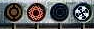

# SWGB user interface

The Star Wars Galactic Battlegrounds user interface is very similar to the one
of age of empires 2. The main difference is a row of indicators displaying unit
capabilities.

## Capabilities indicator

In the center of the user interface, above the unit information area, four
indicators are lined up horizontally. They are turned off when no unit is
selected, and the corresponding element turns on when a unit has or gains one
of the listed capabilities.

In order, from left to right:

* Shield, yellow
* Energy, red when missing power, green when powered, green and turned off if
  the unit is unpowered but doesn't need power
* Stealth, blue
* Detection, blue/white

For illustrative purposes, some screenshots follow:

")

The last screenshot is lower-quality, and the stealth indicator is quite faint.
Compare it to the same screenshot, all indicators off:

")
