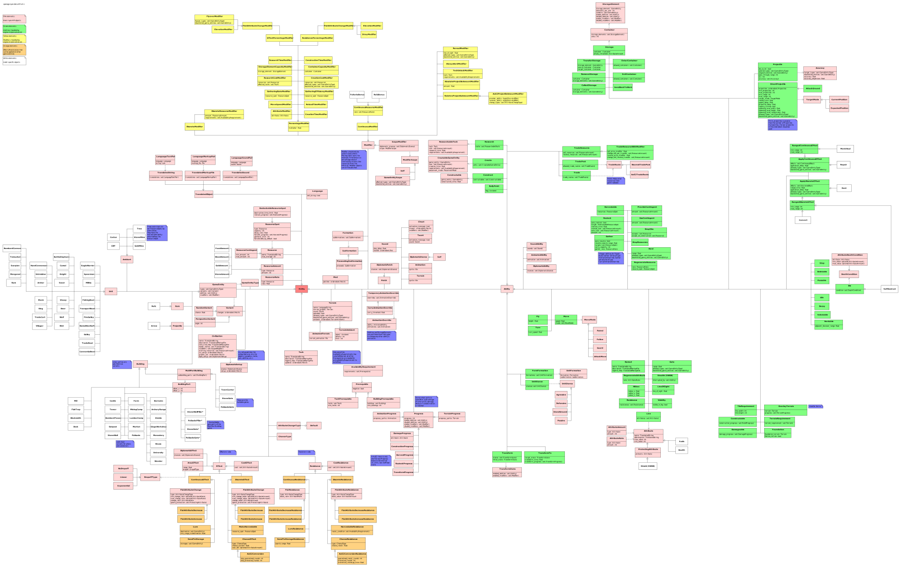

openage nyan library
====================

The openage engine defines all kinds of `NyanObject`s so the nyan interpreter can verify data integrity. Together, the defined objects provide the API that can be used by the games running on the engine.

This interface will be described here.

## Design principles

In addition to the [nyan design goals](https://github.com/SFTtech/nyan/blob/master/doc/nyan.md#design-goals), the openage mod API follows its own design principles. It is recommended to follow these principles when extending the API.

**Single API tree**

The API objects and every additional defined object are part of the same inheritance tree. To ensure this, all objects must inherit from the root object `Entity`, either explicitely or implicitely through its parents. By doing this, we can maintain a consistent object hierarchy, even if several mods are activated.

**Define game entities through abilities**

Game entities are nyan objects that are visibly present in the game world (e.g. units or buildings). Their data will mostly be defined by nested objects inheriting from `Ability`. An `Ability` object is basically a capsule for data and corresponds to an engine function. Therefore, abilities indirectly define what a unit can *do* (attack, gather, move, etc.) or what i can *be* (constructable, selectable, etc.). During a game, the corresponding engine function then decides *how* the data is going to be used.

**No replacement of game entities within their life cycle**

In AoE2, game objects' attributes are mostly static and cannot represent different states. For example, tree objects are replaced with tree stump objects when they are chopped down by villagers, empty trade carts are replaced with full trade carts once they reach a market and villager objects change when they are assigned to a different resource spot. Because nyan objects can dynamically change at runtime, this strategy becomes unfeasible as it becomes increasingly difficult to determine a consistent target state. Instead, abilities will be used for modelling the various states a nyan object has. There also exists the possibility to model game entities as state machines.

**No reliance on inheritance for specialization**

Inheritance cannot be removed from an object, so we have to be careful when introducing it to the API. Instead of inheritance an entity-component model is utilized, e.g. for abilities and modifers. If inheritance is used, it should follow these principles:

* Avoid multi-inheritance in the API tree
* Make it possible to configure the inherited members in such a way that the non-specialized behavior can be replicated

**Genie engine functionality ⊆ nyan API functionality**

The functionality of Genie Engine abilities should always be a subset of the functionality of the openage API. Hardcoding should be removed and integrated into existing abilities.

## API objects

An overview of the API design for the data of Age of Empires 2 is available as an UML diagram.

### Entity

The root object of the nyan tree. Stores no members. All API objects inherit from `Entity`.

### GameEntity

`GameEntity` defines every object that the player will be able to interact with in the game world. The `GameEntity` object is purposefully kept simple to make it versatile and allow as many unit configurations as possible. Characteristics of a game entity, including all stats and animations, are defined through its **abilities** and **modifiers**. Additionally, game entities can have **variants** that can be used for defining alternative graphics (e.g. for villagers or houses). Game entities are classified by assigning them **types** through `GameEntityType`.

### Ability

An `Ability` gives a game entity a **defined behaviour** implemented in an engine function. Abilities are used for both passive (e.g. `Selectable`, `Constructable`) and active behaviour (e.g. `Move`, `Create`, `Gather`). Most abilities have members that further refine the parameters of the behaviour. For example, the `Move` ability enables a game entity to move around the map, while its `speed` member determines how fast the entity moves.

There are currently three ability subtypes available:

* `SoundAbility`: While the ability is used, the game entity plays a sound. If more than one sound is defined in the set, the engine picks one at random.
* `AnimatedAbility`: While the ability is used, the game entity plays an animation. The settings for the animation (speed, angles, frames, looping) are defined in the `.spite` file linked in the `Animation` object and are independent from the ability. If more than one animation is defined in the set, the engine picks one at random.
* `DiplomaticAbility`: Determines whether the ability can be used to interact with other players with a specific diplomatic stance. Diplomatic abilities can only be used on (active abilities) or used by (passive abilities) players that have the diplomatic stance listed in the set. For example, an attack ability where `Enemy` is set in the stances is only able to use this attack on enemy units. If the attack has `Enemy` and `Neutral` in the set, it will also be able to attack neutral units. When `DiplomaticAbility` is not inherited, the ability is available for interaction with all stances by default.

Most abilities have been reworked in comparison to AoE2 to provide extended functionality and make hardcoded parameters accessible to modding. The behaviour of the original game can be seen as a subset of the features in the openage nyan API.

### Modifier

`Modifier` objects alter parts of the behavior of abilities in certain situations. Their main applications are:

* Covering edge cases that do not fit into the definition of an `Ability`. Examples include elevation and cliff attack bonuses as well as free tech unlocks by civs.
* Providing bonuses that are percentage based (e.g. 20% more HP) because they are hard to model as patches.

By default, modifiers apply to the abilities of the game entity that stores them. With `ScopedModifier` the modifier can be applied to other game entities as well. The primary use for this are civilization bonuses.

### Effect

`Effect`s are used for (combat) interaction between two game entities. An effect is actively applied by one game entity (effector) with the `ApplyDiscreteEffect`/`ApplyContinuousEffect` abilities and met with a response by the affected game entity (resistor) using the `Resistance` ability. The use cases for effects are:

* Combat (attacking, healing)
* Conversion
* Making resource spots accessible
* Lure game entities (e.g. sheep)
* Town bell

There are two major types of effects: Discrete and continuous. Discrete effects happen at a *specific point in time*, while continuous effects are applied *over time* at a per second rate. Any discrete effect can be combined with every other discrete effect. The same applies for continuous effects.

For an effect to apply, the effector's `Effect` needs a corresponding `Resistance` object on the resistor's side. Otherwise the effect is not evaluated.
