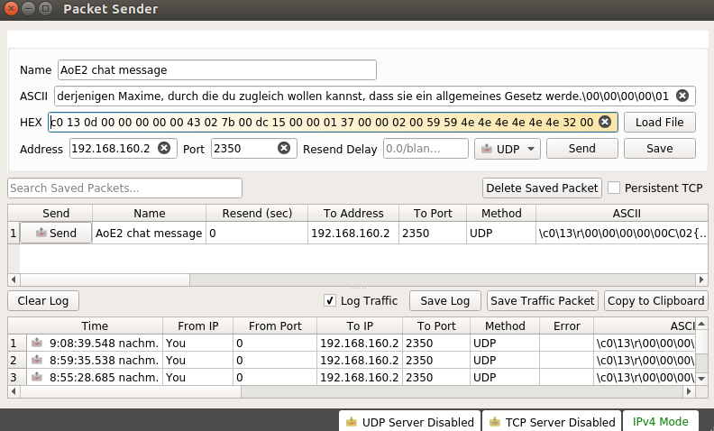
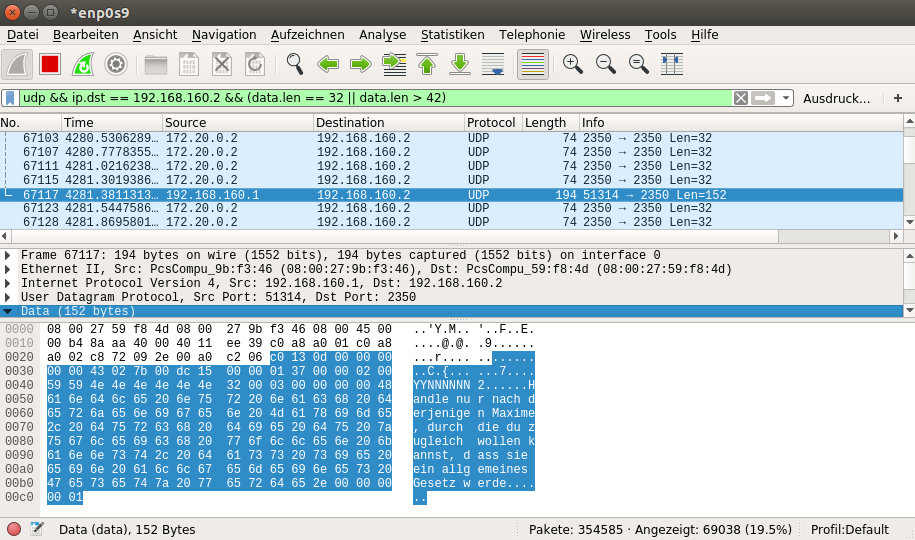

# Spoofing and forging AoC chat messages

## Setup

The test environment consisted of 2 hosts and one router to simulate a 2-player multiplayer game. The hosts were equipped with:

* Ubuntu 17.04
* Age of Empires 2: The Conquerors 1.0c
* Wine 1.8.7

The router was placed as a central point between the two hosts and used for capturing the network traffic. In this example, we also use the router to send the forged UDP packet to one of the host, though in practice, the packet could be spoofed by one of the hosts as well. The setup for our router looks like this:

* Ubuntu 17.04
* Wireshark 2.2.6
* Packet Sender 5.3.1

## Preparation

To construct a message the following parameters are needed:

* Valid Network ID of the Player who is going to be spoofed
* Current communication turn of the game in progress
* Player number of the spoofed sender
* Player number of the receiver(s)

An attacker that is in game with other players will have no problems getting to know the player numbers. As the game is constantly synced, he can easily get the value for *:communication_turn*.

Deriving the valid Sender ID of the receiving player is more difficult and depends on the attacker's ability to capture network traffic. The easiest way to discover all Player IDs is by capturing a few packets of normal gameplay beforehand. The IDs of Players 1-8 have a fixed byte position in the data stream.

## Forging the packet

With the above knowledge and the protocol structure in mind, we are now able to handcraft a message ourselves. We will use the tool Packet Sender for this purpose.

Few values need to be changes, so one can use a sample message packet as a starting point. The Network ID will be replaced with the one of our target. The command byte has to remain at value `0x43`, otherwise the packet will not be recognized as a message. The 3 control bytes after should contain values that fit the message command, but it's not necessary to set them to a specific value. `02 7b 00` and `02 00 00` will work.

The value of *:individual_counter* does not have to be changed, but the *:communication_turn* must have a greater value than the one of the latest 32 byte sync packet (command byte: `0x44`). If the value of *:communication_turn* is smaller, the message will not display. The value of *:communication_turn* determines when the message is displayed or - more precisely - the message will be displayed as soon as the values of *:communication_turn* in the sync packet and of *:communication_turn* in the message packet are equal.

*:player_id* has to be set to spoofed player's ID. The 8 bytes of *intended_receivers* also must change accordingly. The value at position X should be `0x59` when player X is supposed to see the message.

The last thing to change are the message bytes. They will have to be converted to extended ASCII and then placed at the correct location within the data stream. It also has to be stressed that the value for *:message_length* does not have to be changed to the exact length of the message. It has no effect when the message is displayed. Forged messages can be longer than the ingame maximum of 65 characters.

## Execution

Once the data bytes of the packet are ready, one can simply copy them into the HEX field of Packet Sender. We set the target IP address and port number to the receiver's address and port. The AoC standard port is `2350`, but can vary depending on which services run on the receivers computer.

After sending the packet, the receiver will see the message on screen when *:communication_turn* of the sync packet reaches the value in the message packet. The player that we masquerade as will not see the message, unless it is specified in *:communication_turn*.

## Example

As an example we want to send the german original first formulation of the categorical imperative by Immanuel Kant to Player 1. This is not achievable when in game, since the message is 110 characters long (AoC limit: 65 characters). Hence, if Player 1 sees this message, we know that spoofing is possible.

1. Firstly, we create our message with the spoofed parameters:

```
0000 c0 13 0d 00 00 00 00 00 43 02 7b 00 dc 15 00 00
0010 01 37 00 00 02 00 59 59 4e 4e 4e 4e 4e 4e 32 00
0020 03 00 00 00 00 48 61 6e 64 6c 65 20 6e 75 72 20
0030 6e 61 63 68 20 64 65 72 6a 65 6e 69 67 65 6e 20
0040 4d 61 78 69 6d 65 2c 20 64 75 72 63 68 20 64 69
0050 65 20 64 75 20 7a 75 67 6c 65 69 63 68 20 77 6f
0060 6c 6c 65 6e 20 6b 61 6e 6e 73 74 2c 20 64 61 73
0070 73 20 73 69 65 20 65 69 6e 20 61 6c 6c 67 65 6d
0080 65 69 6e 65 73 20 47 65 73 65 74 7a 20 77 65 72
0090 64 65 2e 00 00 00 00 01
```

2. Next up, the data bytes have to be pasted into Packet Sender. Target IP will be `192.168.160.2`, the IP address of Player 1. AoC runs on port `2350`.



3. We will see the packet in Wireshark when it is sent. The value of *:communication_turn* is about 128 ticks behind the one in the latest sync packet. It will therefore take another 16 seconds to be displayed.



4. A few seconds later and the message indeed has arrived for Player 1 and will be displayed.


